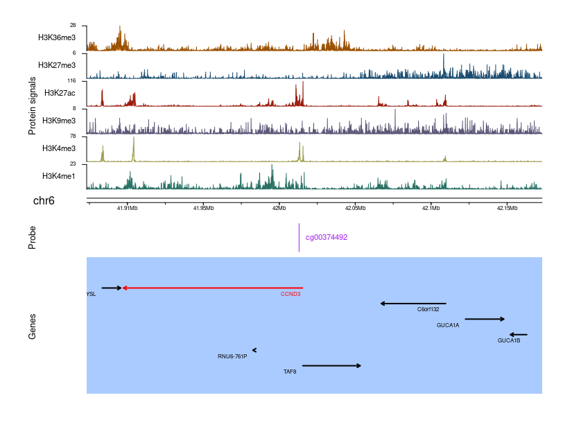

```{r, include = FALSE}
knitr::opts_chunk$set(
  collapse = TRUE,
  comment = "#>"
)
```

## 1. Introduction
EpiMix is a comprehensive tool for the integrative analysis of DNA methylation data and gene expression data (**Figure 1**). EpiMix enables automated data downloading (from TCGA or GEO), pre-processing, methylation modeling, interactive visualization and functional annotation. To identify hypo- or hypermethylated genes, EpiMix uses a beta mixture model to identify the methylation states of each CpG site and compares the DNA methylation of an experimental group to a control group. The output from EpiMix is the functional changes in DNA methylation that is associated with gene expression. 

EpiMix incorporates specialized algorithms to identify functional DNA methylation at various genetic elements, including proximal cis-regulatory elements within or surrounding protein-coding genes, distal enhancers, and genes encoding microRNAs (miRNAs) or lncRNAs. There are four alternative analytic modes for modeling DNA methylation at different genetic elements:

* **Regular**: cis-regulatory elements within or surrounding protein-coding genes.
* **Enhancer**: distal enhancers.
* **miRNA**: miRNA-coding genes.
* **lncRNA**: lncRNA-coding genes.


<br>

## 2. Installation

### 2.1 Bioconductor

```{r, eval = FALSE}
if (!require("BiocManager", quietly = TRUE))
    install.packages("BiocManager")

BiocManager::install(version='devel')

BiocManager::install("EpiMix")
```

### 2.2 Github

```{r, eval = FALSE}
devtools::install_github("gevaertlab/EpiMix.data")
devtools::install_github("gevaertlab/EpiMix")
```

To **load** the EpiMix package in your R session, type `library(EpiMix)`

```{r, message=FALSE, warning=FALSE, include=FALSE}
library(EpiMix)
library(EpiMix.data)
```
**Help files**. Detailed information on each function of the EpiMix package can be obtained in the help files. For example, to view the help file for the function *EpiMix*, use `?EpiMix`.

<br>

## 3. Data input

The `EpiMix` function requires three data matricies as input:

+ **DNA methylation data**: a `matrix` of the DNA methylation data (beta values) with CpG sites in rows and samples in columns.

```{r message=FALSE, warning=FALSE}
data(MET.data)
```
```{r echo=FALSE, message=FALSE, warning=FALSE}
knitr::kable(MET.data[1:5,1:5])
```

+ **(Optional) Gene expression data**: a `matrix` of the matched gene expression data with genes in rows and samples in columns.
If gene expression data are not provided, no comparision for gene expression will be made beteween the differentially methylated groups. Gene expression data can be normalized values from any methods: TPM, RPKM, FPKM, etc. 

```{r message=FALSE, warning=FALSE}
data(mRNA.data)
```
```{r echo=FALSE, message=FALSE, warning=FALSE}
knitr::kable(mRNA.data[1:5,1:5])
```

+ **Sample annotation**: a `dataframe` that maps each sample in the DNA methylation data to a study group. Should contain two columns: the first column (named "primary") indicating the sample names, and the second column (named "sample.type") indicating which study group each sample belongs to (e.g.,“Cancer” vs. “Normal”,  “Experiment” vs. “Control”).

```{r message=FALSE, warning=FALSE}
data(LUAD.sample.annotation)
```

```{r echo=FALSE, message=FALSE, warning=FALSE}
rownums <- nrow(LUAD.sample.annotation)
df1 <- LUAD.sample.annotation[1:4,]
df2 <- LUAD.sample.annotation[(rownums-4):rownums,]
df <- rbind(df1, df2)
knitr::kable(df, row.names = FALSE)
```
<br>

```{r echo=FALSE, message=FALSE, warning=FALSE}
library(DT)
```

## 4. Methylation modeling
<br>

### 4.1 Regular mode

```{r echo=TRUE, message=FALSE, warning=FALSE, results='hide'}
# Specify the output directory
outputDirectory = tempdir()

# We compare the DNA methylation in cancer (group.1) to the normal (group.2) tissues
EpiMixResults_Regular <- EpiMix(methylation.data = MET.data,
                                 gene.expression.data = mRNA.data,
                                 sample.info = LUAD.sample.annotation,
                                 group.1 = "Cancer",
                                 group.2 = "Normal",
                                 met.platform = "HM450",
                                 OutputRoot =  outputDirectory)
```

One of the major outputs of EpiMix is a `$FunctionalPairs` matrix, indicating the differentially methylated CpG sites that are signficantly associated with gene expression:

```{r message=FALSE, warning=FALSE}
datatable(EpiMixResults_Regular$FunctionalPairs[1:5, ],
          options = list(scrollX = TRUE, 
                         autoWidth = TRUE,
                         keys = TRUE, 
                         pageLength = 5, 
                         rownames= FALSE,
                         digits = 3), 
                         rownames = FALSE)

```

### 4.2 Enhancer mode

The Enhancer mode targets DNA methylation analysis on distal enhancers of protein-coding genes. 

```{r, eval = TRUE, message=FALSE, warning=FALSE, results='hide'}
# First, we need to set the analytic mode to enhancer
mode <- "Enhancer"

# Since enhancers are cell or tissue-type specific, EpiMix needs 
# to know the reference cell type or tissue to select proper enhancers.
# Available ids for tissue or cell types can be 
# obtained from Figure 2 of the RoadmapEpigenomic
# paper: https://www.nature.com/articles/nature14248. 
# Alternatively, they can also be retrieved from the 
# built-in function `list.epigenomes()`.

roadmap.epigenome.ids = "E096"   

# Specify the output directory
outputDirectory = tempdir()

# Third, run EpiMix
EpiMixResults_Enhancer <- EpiMix(methylation.data = MET.data, 
                                gene.expression.data = mRNA.data,
                                mode = mode,
                                roadmap.epigenome.ids = roadmap.epigenome.ids,
                                sample.info = LUAD.sample.annotation,
                                group.1 = "Cancer",
                                group.2 = "Normal",
                                met.platform = "HM450",
                                OutputRoot =  outputDirectory)
```

```{r message=FALSE, warning=FALSE}
datatable(EpiMixResults_Enhancer$FunctionalPairs[1:5, ],
          options = list(scrollX = TRUE, 
                         autoWidth = TRUE,
                         keys = TRUE, 
                         pageLength = 5, 
                         rownames= FALSE,
                         digits = 3), 
                         rownames = FALSE)

```

### 4.3 miRNA mode

The miRNA mode targets DNA methylation analysis on miRNA-coding genes. 

```{r, eval=TRUE, message=FALSE, warning=FALSE,  results='hide'}
# Note that running the methylation analysis for miRNA genes need gene expression data for miRNAs
data(microRNA.data)

mode <- "miRNA"

# Specify the output directory
outputDirectory = tempdir()

EpiMixResults_miRNA <- EpiMix(methylation.data = MET.data, 
                        gene.expression.data = microRNA.data,
                        mode = mode,
                        sample.info = LUAD.sample.annotation,
                        group.1 = "Cancer",
                        group.2 = "Normal",
                        met.platform = "HM450",
                        OutputRoot = outputDirectory)
```

```{r,eval=TRUE, message=FALSE, warning=FALSE}
# View the EpiMix results
datatable(EpiMixResults_miRNA$FunctionalPairs[1:5, ],
          options = list(scrollX = TRUE, 
                         autoWidth = TRUE,
                         keys = TRUE, 
                         pageLength = 5, 
                         rownames= FALSE,
                         digits = 3), 
                         rownames = FALSE)
```

### 4.4 lncRNA mode

The lncRNA mode targets DNA methylation analysis on lncRNA-coding genes. 

```{r, eval=TRUE, message=FALSE, warning=FALSE, results='hide'}
# Note: standard RNA-seq processing method can not detect sufficient amount of lncRNAs. 
# To maximize the capture of lncRNA expression, please use the pipeline propoased 
# in our previous study: PMID: 31808800

data(lncRNA.data)

mode <- "lncRNA"

# Specify the output directory
outputDirectory =  tempdir()

EpiMixResults_lncRNA <- EpiMix(methylation.data = MET.data, 
                        gene.expression.data = lncRNA.data,
                        mode = mode,
                        sample.info = LUAD.sample.annotation,
                        group.1 = "Cancer",
                        group.2 = "Normal",
                        met.platform = "HM450",
                        OutputRoot = outputDirectory)
```

```{r,eval=TRUE, message=FALSE, warning = FALSE}
datatable(EpiMixResults_lncRNA$FunctionalPairs[1:5, ],
          options = list(scrollX = TRUE, 
                         autoWidth = TRUE,
                         keys = TRUE,
                         pageLength = 5, 
                         rownames= FALSE,
                         digits = 3), 
                         rownames = FALSE)
```

<br>

## 5. One-step functions for TCGA data

EpiMix enables automated DNA methylation analysis for cancer data from the TCGA project with a single-function `TCGA_GetData`. This function wraps the functions for (1) data downloading, (2) pre-processing and (3) DNA methylation analysis. By default, EpiMix compares the DNA methylation in tumors to normal tissues.

```{r, eval = FALSE}
# Set up the TCGA cancer site. "OV" stands for ovarian cancer.  
CancerSite <- "OV"     

# Specify the analytic mode.
mode <- "Regular"

# Set the file path for saving the output.
outputDirectory <- tempdir()

# Only required if mode == "Enhancer".
roadmap.epigenome.ids = "E097"  

# Run EpiMix

# We highly encourage to use multiple (>=10) CPU cores to 
# speed up the computational process for large datasets

EpiMixResults <- TCGA_GetData(CancerSite = CancerSite, 
                              mode = mode, 
                              roadmap.epigenome.ids = roadmap.epigenome.ids, 
                              outputDirectory = outputDirectory,
                              cores = 10)

```
<br>


## 6. Step-by-step functions for TCGA data

The above one-step functions in Section  can be executed in a step-by-step manner in case users want to inspect the output from each individual step. 

### 6.1 Download and preprocess DNA methylation data from TCGA

+ Download DNA methylation data   

```{r, message=FALSE, results='hide'}
METdirectories <- TCGA_Download_DNAmethylation(CancerSite = "OV", 
                                               TargetDirectory = outputDirectory)
```

```{r, message=FALSE}
cat("HM27k directory:", METdirectories$METdirectory27k, "\n")
cat("HM450k directory:", METdirectories$METdirectory450k, "\n")
```

+ Preprocess DNA methylation data   

Preprocessing includes eliminating samples and genes with too many missing values (default: 20%), imputing remaining missing values, removing single-nucleotide polymorphism (SNP) probes.

```{r, message=FALSE, results='hide'}
METProcessedData <- TCGA_Preprocess_DNAmethylation(CancerSite = "OV", METdirectories)
```

The pre-processed DNA methylation data is a matrix with CpG probes in rows and patient in columns. The values in the matrix represent beta values of DNA methylation:

```{r}
knitr::kable(METProcessedData[1:5,1:5])
```

**Optional**. Since TCGA data were collected in technical batches, systematic differences may exist between technical batches. Users can optionally correct the batch effect using the`doBatchCorrection` parameter. EpiMix provides two alternative methods for batch effect correction: Seurat and Combat. The Seurat method ([PMID: 31178118](https://pubmed.ncbi.nlm.nih.gov/31178118/)) is much more time efficient compared to the Combat ([PMID: 16632515](https://pubmed.ncbi.nlm.nih.gov/16632515/)). If using the Combat method, users are encouraged to use multiple CPU cores by tuning the `cores` parameter.

<br>

### 6.2 Download and preprocess gene expression data 

```{r, eval=TRUE, message = FALSE, results='hide'}
# If use the Regular or the Enhancer mode: 
GEdirectories <- TCGA_Download_GeneExpression(CancerSite = "OV", 
                                              TargetDirectory = outputDirectory)
                                              

# If use the miRNA mode, download miRNA expression data:
mode <- "miRNA"
GEdirectories <- TCGA_Download_GeneExpression(CancerSite = "OV", 
                                              TargetDirectory = outputDirectory, 
                                              mode = mode)

# If use the lncRNA mode, download lncRNA expression data:
mode <- "lncRNA"
GEdirectories <- TCGA_Download_GeneExpression(CancerSite = "OV", 
                                              TargetDirectory = outputDirectory, 
                                              mode = mode)
```

+ Preprocess gene expression data

```{r, message = FALSE, results='hide'}
GEProcessedData <- TCGA_Preprocess_GeneExpression(CancerSite = "OV", 
                                                  MAdirectories = GEdirectories, 
                                                  mode = mode
                                                  )
```
The pre-processed gene expression data is a matrix with gene in rows and patients in columns.

**Example of gene expression data**: 

|        | TCGA-04-1331-01| TCGA-04-1332-01| TCGA-04-1335-01| TCGA-04-1336-01| TCGA-04-1337-01|
|:-------|---------------:|---------------:|---------------:|---------------:|---------------:|
|ELMO2   |      -0.6204167|        0.184750|      -0.6716667|       -1.105500|       0.7858333|
|CREB3L1 |      -0.0032500|        1.008500|       1.2210000|       -0.623000|       1.1265000|
|RPS11   |       0.5672500|        0.967625|      -0.2337500|        0.555375|       0.6608750|
|PNMA1   |       1.2940000|        1.159000|      -0.8425000|        0.476750|       0.6160000|
|MMP2    |      -0.3280000|        0.416500|      -1.1091667|       -1.716333|       0.9626667|

+ Generate the sample annotation

To identify the hypo- or hyper-methylated genes, EpiMix compares the DNA methylation in tumors to normal tissues. Therefore, EpiMix needs to know which samples in the DNA methylation and gene expression data are tumors (group.1), and which are normal tissues (group.2). The `TCGA_GetSampleInfo` function can be used to generate a dataframe of sample information.

```{r, message = FALSE, results='hide'}
sample.info = TCGA_GetSampleInfo(METProcessedData = METProcessedData,
                                 CancerSite = "OV", 
                                 TargetDirectory = outputDirectory)
```
The `sample.info` is a dataframe with two columns: the **primary** column indicates the sample identifiers and the **sample.type** column indicates which group each sample belongs to:

```{r}
knitr::kable(sample.info[1:4,])
```
<br>


## 7. Visualization

EpiMix enables diverse types of visualization. 

### 7.1 Mixture model and gene expression

```{r eval=TRUE, message=FALSE, warning=FALSE, results = 'hide'}
data(Sample_EpiMixResults_Regular)

plots <- EpiMix_PlotModel(
                 EpiMixResults = Sample_EpiMixResults_Regular, 
                 Probe = "cg14029001", 
                 methylation.data = MET.data, 
                 gene.expression.data = mRNA.data,
                 GeneName = "CCND3"
                 )
```
```{r eval=TRUE, fig.show="hold", message=FALSE, warning=FALSE, out.width="33%"}
# Mixture model of the DNA methylation of the CCND3 gene at cg14029001
plots$MixtureModelPlot

# Violin plot of the gene expression levels of the CCND3 gene in different mixtures
plots$ViolinPlot

# Correlation between DNA methylation and gene expression of CCND3
plots$CorrelationPlot
```
<br>

### 7.2 Genome-browser style visualization

#### 7.2.1 Integrative visualization of the chromatin state, DNA methylation, and transcript structure of a specific gene

```{r, message = FALSE, warning=FALSE, eval=FALSE, fig.show="hold", dev='png', out.width="110%", results = 'hide', fig.cap = "Integrative visualization of the chromatin state, DM values and the transcript structure of the *CCND2* gene. The differential methylation (DM) value represents the mean difference in beta values between the hypermethylated samples versus the normally methylated samples"}
library(karyoploteR)
library(TxDb.Hsapiens.UCSC.hg19.knownGene)
library(org.Hs.eg.db)
library(regioneR)

data(Sample_EpiMixResults_Regular)

gene.name = "CCND2"
met.platform = "HM450"

# Since the chromatin states are cell-type specific, we need to specify a reference cell or 
# tissue type for plotting. Available cell or tissue type can be found in
# Figure 2 of the Roadmap Epigenomics paper (nature, PMID: 25693563): 
# https://www.nature.com/articles/nature14248 

roadmap.epigenome.id = "E096"
  
EpiMix_PlotGene(gene.name = gene.name,
                EpiMixResults = Sample_EpiMixResults_Regular, 
                met.platform = met.platform,
                roadmap.epigenome.id = roadmap.epigenome.id
               )

```


<br>

#### 7.2.2 Plot the chromatin state of a CpG site and the expression of its nearby genes 

This plot is used for visualization of a differentially methylated enhancer. The genes shown in red are the genes whose transcription was negatively associated with the DNA methylation of an enhancer. 

```{r, message = FALSE, warning=FALSE, eval=FALSE, fig.show="hold", dev='png', out.width="110%", results = 'hide', fig.cap = "Integrative visualization of the chromatin state and the nearby genes of a differentially methylated CpG site"}
# The CpG site to plot
probe.name = "cg00374492"

# The number of adjacent genes to be plotted
# Warnings: setting the gene number to a high value (>20 genes) may blow the internal memory
numFlankingGenes = 10

# Set up the reference cell/tissue type
roadmap.epigenome.id = "E096"

# Generate the plot
EpiMix_PlotProbe(probe.name, 
                 EpiMixResults = Sample_EpiMixResults_Regular, 
                 met.platform = "HM450", 
                 numFlankingGenes = numFlankingGenes, 
                 roadmap.epigenome.id = roadmap.epigenome.id,
                 left.gene.margin = 10000,  # left graph margin in nucleotide base pairs
                 right.gene.margin = 10000  # right graph margin in nucleotide base pairs
                 )
```


<br>

## 8. Pathway enrichment analysis

EpiMix integrates the `clusterProfiler` R package to perform the function enrichment analysis of the differentially methylated genes. Enrichment results can be visualized in both **tabular** format and in **graphic** format. See [this paper](https://pubmed.ncbi.nlm.nih.gov/34557778/) for more details. 

### 8.1 Gene ontology (GO) analysis

```{r, message=FALSE, warning=FALSE, results="hide"}
library(clusterProfiler)
library(org.Hs.eg.db)

# We want to check the functions of both the hypo- and hypermethylated genes. 
methylation.state = "all"

# Use the gene ontology for functional analysis.
enrich.method = "GO"

# Use the "biological process" subterm
selected.pathways = "BP"

# Perform enrichment analysis 
enrich.results <- functionEnrich(EpiMixResults = Sample_EpiMixResults_Regular,
                                  methylation.state = methylation.state,
                                  enrich.method = enrich.method,
                                  ont = selected.pathways,
                                  simplify = TRUE,
                                  save.dir = "" 
                                  )
```

```{r eval=TRUE, message=FALSE, warning=FALSE, results = "asis"}
knitr::kable(head(enrich.results), row.names = FALSE)
```

### 8.2 KEGG pathway enrichment analysis

```{r eval=TRUE, message=FALSE, warning=FALSE, results = "hide"}
enrich.results <- functionEnrich(EpiMixResults = Sample_EpiMixResults_Regular,
                                  methylation.state = "all",
                                  enrich.method = "KEGG",
                                  simplify = TRUE,
                                  save.dir = "")
```
```{r eval=TRUE, message=FALSE, warning=FALSE, results = "asis"}
knitr::kable(head(enrich.results), row.names = FALSE)
```

<br>

## 9. Biomarker identification 

After the differentially methylated genes were identified, we look for the genes whose methylation states are associated with patient survival. For each differentially methylated CpG, we compare the survival of the abnormally methylated patients to the normally methylated patients. The `GetSurvivalProbe` function generates all the survival associated CpGs.

```{r eval=TRUE, message=FALSE, warning=FALSE, results = "hide"}
library(survival)

# We use a sample result from running the EpiMix's miRNA mode on the 
# lung adenocarcinomas (LUAD) data from TCGA
data("Sample_EpiMixResults_miRNA")

# Set the TCGA cancer site. 
CancerSite = "LUAD"

# Find survival-associated CpGs/genes
survival.CpGs <- GetSurvivalProbe (EpiMixResults = Sample_EpiMixResults_miRNA, TCGA_CancerSite = CancerSite)
                                    
```
```{r eval=TRUE, message=FALSE, warning=FALSE, results = "asis"}
knitr::kable(survival.CpGs, row.names = FALSE)
```

Plot the Kaplan-Meier survival curve for the normally and the abnormally methylated patients.

```{r, message = FALSE, warning=FALSE, fig.show="hold", dev='png', fig.cap = "Survival curve for patients showing different methylation states at the CpG cg00909706", results = "hide"}
library(survminer)

# Select the target CpG site whose methylation states will be evaluated
Probe = "cg00909706"

# If using data from TCGA, just input the cancer site 
CancerSite = "LUAD"

EpiMix_PlotSurvival(EpiMixResults = Sample_EpiMixResults_miRNA, 
                                     plot.probe = Probe,
                                     TCGA_CancerSite = CancerSite)
```

## 10. Find potential miRNA targets

Find miRNA targets whose transcription levels are associated with the differential methylation of miRNAs:
1. Hyper-methylation miRNA -> upregulation of targets
2. Hypo-methylation miRNA -> downregulation of targets

```{r echo=TRUE, message=FALSE, warning=FALSE, results='hide'}
library(multiMiR)
library(miRBaseConverter)

miRNA_targets <- find_miRNA_targets(
 EpiMixResults = Sample_EpiMixResults_miRNA,
 geneExprData = mRNA.data
)
```

```{r message=FALSE, warning=FALSE}
datatable(miRNA_targets[1:5, ],
          options = list(scrollX = TRUE, 
                         autoWidth = TRUE,
                         keys = TRUE, 
                         pageLength = 5, 
                         rownames= FALSE,
                         digits = 3), 
                         rownames = FALSE)
```

Now, the `Fold change of gene expression` column indicates the change of gene expression for the miRNA targets, where the comparisions were made between patients with different methylation states for the corresponding miRNAs.

## 11. Session Information

```{r}
sessionInfo()
```
