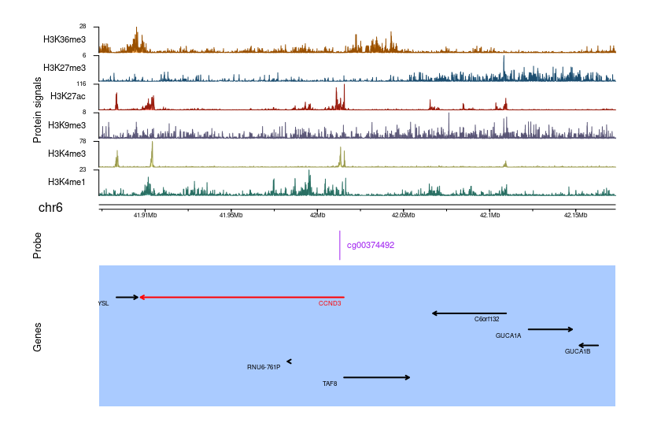
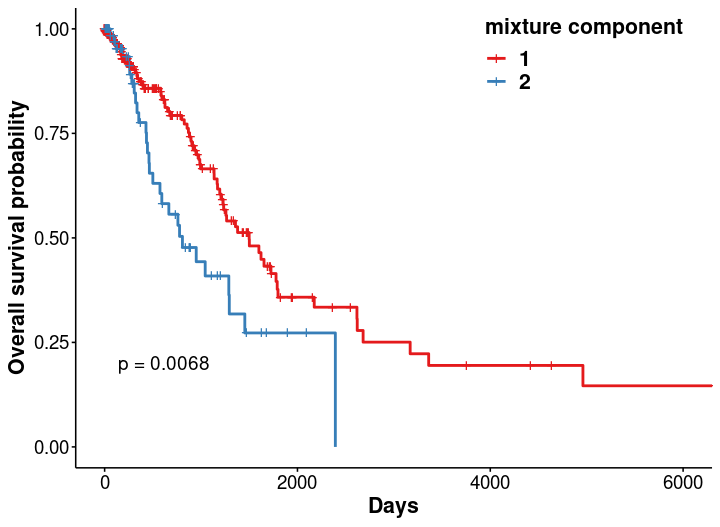

```{r, include = FALSE}
knitr::opts_chunk$set(
  collapse = TRUE,
  comment = "#>"
)
```

## 1. Introduction
EpiMix is a comprehensive tool for the integrative analysis of DNA methylation data and gene expression data (**Figure 1**). EpiMix enables automated data downloading (from TCGA or GEO), pre-processing, methylation modeling, interactive visualization and functional annotation. To identify hypo- or hypermethylated genes, EpiMix uses a beta mixture model to identify the methylation states of each CpG site and compares the DNA methylation of an experimental group to a control group. The output from EpiMix is the functional changes in DNA methylation that is associated with gene expression. 

EpiMix incorporates specialized algorithms to identify functional DNA methylation at various genetic elements, including proximal cis-regulatory elements of protein-coding genes, distal enhancers, and genes encoding microRNAs (miRNAs) or lncRNAs. There are four alternative analytic modes for modeling DNA methylation at different genetic elements:

* **Regular**: proximal cis-regulatory elements of protein-coding genes.
* **Enhancer**: distal enhancers.
* **miRNA**: miRNA-coding genes.
* **lncRNA**: lncRNA-coding genes.


<br>

## 2. Installation
To **install** the EpiMix package, the easiest way is through bioconductor:

```{r, eval = FALSE}
if (!requireNamespace("BiocManager", quietly=TRUE))
    install.packages("BiocManager")
BiocManager::install(EpiMix)
```
To **load** the EpiMix package in your R session, type `library(EpiMix)`

```{r, message=FALSE, warning=FALSE, include=FALSE}
library(EpiMix)
```
**Help files**. Detailed information on each function of the EpiMix package can be obtained in the help files. For example, to view the help file for the function *EpiMix*, use `?EpiMix`.

<br>

## 3. One-step functions

EpiMix enables the generation of the results for data from the TCGA project with a single-function `TCGA_GetData`. This function wraps the functions for data downloading, pre-processing and DNA methylation analysis.

* **Regular mode**

```{r, eval = FALSE}
# Set up the TCGA cancer site. "OV" stands for ovarian cancer.  
CancerSite <- "OV"     

# Set up the analytic mode
mode <- "Regular"

# Set the file path for saving the output.
outputDirectory <- paste0(getwd(), "/Test")

# Run EpiMix
EpiMixResults <- TCGA_GetData(CancerSite = CancerSite, 
                              mode = mode, 
                              outputDirectory = outputDirectory)

```
<br>

* **Enhancer mode**

```{r, eval = FALSE}
# Set up the TCGA cancer site. "OV" stands for ovarian cancer. 
CancerSite <- "OV"  

# Set up the analytic mode
mode <- "Enhancer"

# Set the file path for saving the output.
outputDirectory <- paste0(getwd(), "/Test")
```

Since enhancers are cell or tissue-type specific, EpiMix needs to know the reference cell or tissue type(s) in order to select the proper enhancers. EpiMix identifies the enhancers from the RoadmapEpigenomic project ([Nature, 2015,PMID: 25693563](https://www.nature.com/articles/nature14248)), in which enhancers were identified by ChromHMM in over 100 tissue and cell types. Available epigenome groups (a group of relevant cell types) or epigenome ids (individual cell types) can  be obtained from **Figure 2** of the [RoadmapEpigenomic publication](https://www.nature.com/articles/nature14248). Alternatively, they can also be retrieved from the EpiMix's built-in function `list.epigenomes()`.

```{r, eval = FALSE}
# "E097" represents overy 
roadmap.epigenome.ids = "E097"   

# Run EpiMix
EpiMixResults <- TCGA_GetData(CancerSite = CancerSite,
                              mode = mode,
                              roadmap.epigenome.ids = roadmap.epigenome.ids,
                              outputDirectory = outputDirectory)
```
<br>

* **miRNA mode**

```{r, eval = FALSE}
# Set up the TCGA cancer site. "OV" stands for ovarian cancer. 
CancerSite <- "OV"

# Set up the analytic mode
mode <- "miRNA"

# Set the file path for saving the output.
outputDirectory <- paste0(getwd(), "/Test")

EpiMixResults <- TCGA_GetData(CancerSite = CancerSite, 
                              mode = mode, 
                              outputDirectory = outputDirectory)

```
<br>

* **lncRNA mode**

```{r, eval = FALSE}
# Set up the TCGA cancer site. "OV" stands for ovarian cancer. 
CancerSite <- "OV"

# Set up the analytic mode
mode <- "lncRNA"

# Set the file path for saving the output.
outputDirectory <- paste0(getwd(), "/Test")

# Run EpiMix
EpiMixResults <- TCGA_GetData(CancerSite = CancerSite, 
                              mode = mode, 
                              outputDirectory = outputDirectory)

```
<br>

## 4. Step-by-step functions

The above one-step functions can be executed in a step-by-step manner in case users want to inspect the output from each individual step or to use their customized dataset not from the TCGA project. 

### 4.1 Download and preprocess DNA methylation data from TCGA

+ Download DNA methylation data   

```{r, eval=FALSE}
# Set up the TCGA cancer site. "OV" stands for ovarian cancer. 
CancerSite <- "OV" 

# Set the file path where the data will be saved. 
outputDirectory <- paste0(getwd(), "/Test")

# Download DNA methylation data
METdirectories <- TCGA_Download_DNAmethylation(CancerSite = CancerSite, 
                                               TargetDirectory = outputDirectory)
```

+ Preprocess DNA methylation data   

Preprocessing includes eliminating samples and genes with too many missing values (default: 20%), imputing remaining missing values, removing single-nucleotide polymorphism (SNP) probes.

```{r eval=FALSE, message=FALSE}
METProcessedData <- TCGA_Preprocess_DNAmethylation(CancerSite, METdirectories)
```

The pre-processed DNA methylation data is a matrix with CpG probes in rows and patient in columns. The values in the matrix represent beta values of DNA methylation.

**Example of DNA methylation data**: 

|           | TCGA-04-1331-01| TCGA-04-1332-01| TCGA-04-1335-01| TCGA-04-1336-01| TCGA-04-1337-01|
|:----------|---------------:|---------------:|---------------:|---------------:|---------------:|
|cg00000292 |       0.9221302|       0.4648186|       0.9042943|       0.7567368|       0.8791313|
|cg00002426 |       0.1486593|       0.0562675|       0.2632028|       0.2009483|       0.0726626|
|cg00003994 |       0.0293567|       0.0344792|       0.0552332|       0.0840847|       0.0209836|
|cg00005847 |       0.8248150|       0.4201426|       0.6690116|       0.7688814|       0.7630715|
|cg00007981 |       0.0177981|       0.0122320|       0.0410097|       0.0276765|       0.0110274|


**Optional**. Since TCGA data were collected in technical batches, systematic differences may exist between technical batches. Users can optionally correct the batch effect using the`doBatchCorrection` parameter. EpiMix provides two alternative methods for batch effect correction: Seurat and Combat. The Seurat method ([PMID: 31178118](https://pubmed.ncbi.nlm.nih.gov/31178118/)) is much more time efficient compared to the Combat ([PMID: 16632515](https://pubmed.ncbi.nlm.nih.gov/16632515/)). If using the Combat method, users are encouraged to use multiple CPU cores by tuning the `cores` parameter.

<br>

### 4.2 Download and preprocess gene expression data 

EpiMix incorporates four alternative analytic modes for modeling DNA methylation: “Regular,” “Enhancer”, “miRNA” and “lncRNA” (see **Introduction**). The "Regular" mode and the "Enhancer" mode use gene expression data from regular RNA-seq. To use the "miRNA" mode, we need to download gene expression data for miRNAs. To use the "lncRNA" mode, we need to download the gene expression data for lncRNAs. The `mode` parametercontrols which set of gene expression data to download. 

```{r, eval=FALSE}
# If use the Regular or the Enhancer mode: 
mode <- "Regular"
GEdirectories <- TCGA_Download_GeneExpression(CancerSite = CancerSite, 
                                              TargetDirectory = targetDirectory, 
                                              mode = mode)

# If use the miRNA mode, download miRNA expression data:
mode <- "miRNA"
GEdirectories <- TCGA_Download_GeneExpression(CancerSite = CancerSite, 
                                              TargetDirectory = targetDirectory, 
                                              mode = mode)

# If use the lncRNA mode, download lncRNA expression data:
mode <- "lncRNA"
GEdirectories <- TCGA_Download_GeneExpression(CancerSite = CancerSite, 
                                              TargetDirectory = targetDirectory, 
                                              mode = mode)
```

+ Preprocess gene expression data

```{r, eval=FALSE}
GEProcessedData <- TCGA_Preprocess_GeneExpression(CancerSite = CancerSite, 
                                                  MAdirectories = GEdirectories, 
                                                  mode = mode,
                                                  doBatchCorrection = FALSE
                                                  )
```
The pre-processed gene expression data is a matrix with gene in rows and patients in columns.

**Example of gene expression data**: 

|        | TCGA-04-1331-01| TCGA-04-1332-01| TCGA-04-1335-01| TCGA-04-1336-01| TCGA-04-1337-01|
|:-------|---------------:|---------------:|---------------:|---------------:|---------------:|
|ELMO2   |      -0.6204167|        0.184750|      -0.6716667|       -1.105500|       0.7858333|
|CREB3L1 |      -0.0032500|        1.008500|       1.2210000|       -0.623000|       1.1265000|
|RPS11   |       0.5672500|        0.967625|      -0.2337500|        0.555375|       0.6608750|
|PNMA1   |       1.2940000|        1.159000|      -0.8425000|        0.476750|       0.6160000|
|MMP2    |      -0.3280000|        0.416500|      -1.1091667|       -1.716333|       0.9626667|

+ Generate the sample annotation

To identify the hypo- or hyper-methylated genes, EpiMix compares the DNA methylation in tumors to normal tissues. Therefore, EpiMix needs to know which samples in the DNA methylation and gene expression data are tumors (group.1), and which are normal tissues (group.2). The `TCGA_GetSampleInfo` function can be used to generate a dataframe of sample information.

```{r, eval=FALSE}
sample.info = TCGA_GetSampleInfo(METProcessedData = METProcessedData, # pre-processed DNA methylation data
                                 CancerSite = CancerSite, 
                                 targetDirectory = targetDirectory)
```

The `sample.info` is a dataframe with two columns: the **primary** column indicates the sample identifiers and the **sample.type** column indicates which group each sample belongs to. 

**Example of sample information**: 

|primary         |sample.type |
|:---------------|:-----------|
|TCGA-04-1331-01 |Cancer      |
|TCGA-04-1332-01 |Cancer      |
|TCGA-04-1335-01 |Cancer      |
|TCGA-01-0630-11 |Normal      |
|TCGA-01-0631-11 |Normal      |
|TCGA-01-0633-11 |Normal      |

<br>

### 4.3. Methylation modeling

To model DNA methylation, EpiMix uses a univariate beta mixture model to identify the methylation states of each CpG site, where each methylation state represents a subset of samples with a statistically similar methylation pattern. To identify hypo- or hypermethylated CpGs, EpiMix compares the mean methylation levels of each methylation state of a CpG site in the experiment group (group.1) to the mean methylation of its counterpart in the control group (group.2). Here, we used a sample dataset from lung adenocarcinomas (LUAD) of the TCGA project for illustration. 

### Data input

**An example of the data input has been shown in the section (Section 4.2) above.** 

The `EpiMix` function requires three data sets as input:

+ DNA methylation data: a matrix of the DNA methylation data (beta values) with CpG sites in rows and samples in columns.

+ Matched gene expression data: a matrix of the gene expression data with genes in rows and samples in columns.

+ Sample annotation: a dataframe that maps each sample in the DNA methylation data to a study group. Should contain two columns: the first column (named "primary") indicating the sample names, and the second column (named "sample.type") indicating which study group each sample belongs to (e.g.,“Cancer” vs. “Normal”,  “Experiment” vs. “Control”).

<br>

#### 4.3.1 Regular mode

The Regular mode targets DNA methylation analysis on protein-coding genes 

```{r echo=TRUE, message=FALSE, warning=FALSE, results='hide'}
library(EpiMix)
library(EpiMix.data)
library(DT)

data(MET.data)
data(mRNA.data)
data(LUAD.sample.annotation)

# EpiMix can automatically save the results to a user-specified directory
outputDirectory =  paste0(getwd(), "/Test")

# We compare the DNA methylation in cancer (group.1) to the normal (group.2) tissues
EpiMixResults_Regular <- EpiMix(methylation.data = MET.data,
                       gene.expression.data = mRNA.data,
                       sample.info = LUAD.sample.annotation,
                       group.1 = "Cancer",
                       group.2 = "Normal",
                       met.platform = "HM450",
                       OutputRoot =  outputDirectory
                       )
```

```{r,eval=TRUE, message=FALSE, warning = FALSE}
# View the EpiMix results
datatable(EpiMixResults_Regular$FunctionalPairs[1:5, ],
          options = list(scrollX = TRUE, 
                         autoWidth = TRUE,
                         keys = TRUE, 
                         pageLength = 5, 
                         digits = 3), 
          rownames = TRUE)

```

#### 4.3.2 Enhancer mode

The Enhancer mode targets DNA methylation analysis on distal enhancers of protein-coding genes. 

```{r, eval = FALSE}
library(EpiMix)
library(EpiMix.data)
library(DT)

data(MET.data)
data(mRNA.data)
data(LUAD.sample.annotation)

# First, we need to set the analytic mode to enhancer
mode <- "Enhancer"

# Second, we need to set up a reference tissue type (see Section 3 for explanations)
# "E096" indicates lung
roadmap.epigenome.ids = "E096"   

# EpiMix can automatically save the results to a user-specified directory
outputDirectory =  paste0(getwd(), "/Test")

# Third, run EpiMix
EpiMixResults_Enhancer <- EpiMix(
                        methylation.data = MET.data, 
                        gene.expression.data = mRNA.data,
                        mode = mode,
                        roadmap.epigenome.ids = roadmap.epigenome.ids,
                        sample.info = LUAD.sample.annotation,
                        group.1 = "Cancer",
                        group.2 = "Normal",
                        met.platform = "HM450",
                        OutputRoot =  outputDirectory
                       )
```

#### 4.3.3 miRNA mode

The miRNA mode targets DNA methylation analysis on miRNA-coding genes. 

```{r, eval=TRUE, message=FALSE, warning=FALSE,  results='hide'}
library(EpiMix)
library(EpiMix.data)
library(DT)

data(MET.data)
data(microRNA.data)
data(LUAD.sample.annotation)

mode <- "miRNA"

# EpiMix can automatically save the results to a user-specified directory
outputDirectory =  paste0(getwd(), "/Test")

EpiMixResults_miRNA <- EpiMix(methylation.data = MET.data, 
                        gene.expression.data = microRNA.data,
                        mode = mode,
                        sample.info = LUAD.sample.annotation,
                        group.1 = "Cancer",
                        group.2 = "Normal",
                        met.platform = "HM450",
                        OutputRoot = outputDirectory
                        )
```

```{r,eval=TRUE, message=FALSE, warning=FALSE}
# View the EpiMix results
datatable(EpiMixResults_miRNA$FunctionalPairs[1:5, ],
          options = list(scrollX = TRUE, 
                         autoWidth = TRUE,
                         keys = TRUE, 
                         pageLength = 5, 
                         digits = 3), 
          rownames = TRUE)
```

#### 4.3.4 lncRNA mode

The lncRNA mode targets DNA methylation analysis on lncRNA-coding genes. 

```{r, eval=TRUE, message=FALSE, warning=FALSE, results='hide'}
library(EpiMix)
library(EpiMix.data)
library(DT)

data(MET.data)
data(lncRNA.data)
data(LUAD.sample.annotation)

mode <- "lncRNA"

# EpiMix can automatically save the results to a user-specified directory
outputDirectory =  paste0(getwd(), "/Test")

EpiMixResults_lncRNA <- EpiMix(methylation.data = MET.data, 
                        gene.expression.data = lncRNA.data,
                        mode = mode,
                        sample.info = LUAD.sample.annotation,
                        group.1 = "Cancer",
                        group.2 = "Normal",
                        met.platform = "HM450",
                        OutputRoot = outputDirectory
                        )

```

```{r,eval=TRUE, message=FALSE, warning = FALSE}
datatable(EpiMixResults_lncRNA$FunctionalPairs[1:5, ],
          options = list(scrollX = TRUE, 
                         autoWidth = TRUE,
                         keys = TRUE,
                         pageLength = 5, 
                         digits = 3), 
          rownames = TRUE)
```

<br>

## 5. Visualization

EpiMix enables diverse types of visualization. 

### 5.1 Mixture model of the DNA methylation, violin plot of the gene expression, and correlation plot of the DNA methylation and gene expression

```{r eval=TRUE, message=FALSE, warning=FALSE, results = 'hide'}
data(MET.data)
data(mRNA.data)
data(Sample_EpiMixResults_Regular)

# CpG probe name
probe = "cg14029001"
# Gene name
gene.name = "CCND3"
# plot
plots <- EpiMix_PlotModel(
                 EpiMixResults = Sample_EpiMixResults_Regular, 
                 Probe = probe, 
                 methylation.data = MET.data, 
                 gene.expression.data = mRNA.data,
                 GeneName = gene.name
                 )
```
```{r eval=TRUE, fig.show="hold", message=FALSE, warning=FALSE, out.width="33%"}
# Mixture model of the DNA methylation of the CCND3 gene at cg14029001
plots$MixtureModelPlot

# Violin plot of the gene expression levels of the CCND3 gene in different mixtures
plots$ViolinPlot

# Correlation between DNA methylation and gene expression of CCND3
plots$CorreilationPlot
```
<br>

### 5.2 Genome-browser style visualization

#### 5.2.1 Integrative visualization of the chromatin state, DNA methylation, and transcript structure of a specific gene

```{r, eval=FALSE}
library(EpiMix)
library(karyoploteR)
library(TxDb.Hsapiens.UCSC.hg19.knownGene)
library(org.Hs.eg.db)
library(regioneR)

data(Sample_EpiMixResults_Regular)

gene.name = "CCND2"
met.platform = "HM450"

# Since the chromatin states are cell-type specific, we need to specify a  reference cell or 
# tissue type for plotting. Available cell or tissue type can be found in
# Figure 2 of the Roadmap Epigenomics paper (nature, PMID: 25693563): 
# https://www.nature.com/articles/nature14248 

roadmap.epigenome.id = "E096" # "E096" indicates lung. 
  
EpiMix_PlotGene(gene.name = gene.name,
          EpiMixResults = Sample_EpiMixResults_Regular, 
          met.platform = met.platform,
          roadmap.epigenome.id = roadmap.epigenome.id
          )
```


<br>

#### 5.2.2 Plot the chromatin state of a CpG site and the expression of its nearby genes 

This plot is used for visualization of a differentially methylated enhancer. The genes shown in red are the genes whose transcription was negatively associated with the DNA methylation of an enhancer. 

```{r, eval = FALSE}
library(EpiMix)
library(karyoploteR)
library(TxDb.Hsapiens.UCSC.hg19.knownGene)
library(org.Hs.eg.db)
library(regioneR)

data(Sample_EpiMixResults_Regular)

# The CpG site to plot
probe.name = "cg00374492"

# The number of adjacent genes to be plotted
# Warnings: setting the gene number to a high value (>20 genes) may blow the internal memory
numFlankingGenes = 10

# Set up the reference cell/tissue type
roadmap.epigenome.id = "E096"      # "E096" indicates lung

# Generate the plot
EpiMix_PlotProbe(probe.name, 
                 EpiMixResults = Sample_EpiMixResults_Regular, 
                 met.platform = "HM450", 
                 numFlankingGenes = numFlankingGenes, 
                 roadmap.epigenome.id = roadmap.epigenome.id,
                 left.gene.margin = 10000,  # left graph margin in nucleotide base pairs
                 right.gene.margin = 10000  # right graph margin in nucleotide base pairs
                 )
```


<br>

## 6. Pathway enrichment analysis

EpiMix integrates the `clusterProfiler` R package to perform the function enrichment analysis of the differentially methylated genes. Enrichment results can be visualized in both **tabular** format and in **graphic** format. See [this paper](https://pubmed.ncbi.nlm.nih.gov/34557778/) for more details. 

### 6.1 Gene ontology (GO) analysis

```{r, eval = FALSE}
library(clusterProfiler)
library(org.Hs.eg.db)

data(Sample_EpiMixResults_Regular)

# We want to check the functions of both the hypo- and hypermethylated genes. 
methylation.state = "all"

# Use the gene ontology for functional analysis.
enrich.method = "GO"

# Use the "biological process" subterm
selected.pathways = "BP"

# Perform enrichment analysis 
enrich.results <- function.enrich(
                                  EpiMixResults = Sample_EpiMixResults_Regular,
                                  methylation.state = methylation.state,
                                  enrich.method = enrich.method,
                                  ont = selected.pathways,
                                  simplify = TRUE,  # get rid of overlapping pathways
                                  save.dir = "" 
                                  )
# Check the enrichment results
View(enrich.results@result)
```
|           |ID         |Description                                                                      |GeneRatio |BgRatio  |   pvalue|  p.adjust|   qvalue|geneID      | Count|
|:----------|:----------|:--------------------------------------------------------------------------------|:---------|:--------|--------:|---------:|--------:|:-----------|-----:|
|GO:0045737 |GO:0045737 |positive regulation of cyclin-dependent protein serine/threonine kinase activity |2/5       |30/18862 | 2.44e-05| 0.0015716| 0.000397|CCND2/CCND3 |     2|
|GO:1904031 |GO:1904031 |positive regulation of cyclin-dependent protein kinase activity                  |2/5       |34/18862 | 3.14e-05| 0.0015716| 0.000397|CCND2/CCND3 |     2|

### 6.2 KEGG pathway enrichment analysis

```{r, eval=FALSE}
enrich.results <- function.enrich(EpiMixResults = Sample_EpiMixResults_Regular,
                                  methylation.state = "all",
                                  enrich.method = "KEGG",
                                  simplify = TRUE,
                                  save.dir = "")
# Check the enrichment results in tabular format
View(enrich.results@result)
```
<br>

## 7. Biomarker identification 

After the differentially methylated genes were identified, we look for the genes whose methylation states are associated with patient survival. For each differentially methylated CpG, we compare the survival of the abnormally methylated patients to the normally methylated patients. The `get.survival.probe` function generates all the survival associated CpGs.

```{r, eval=FALSE}
library(survival)

# We use a sample result from running the EpiMix's miRNA mode on the 
# lung adenocarcinomas (LUAD) data from TCGA
data("Sample_EpiMixResults_miRNA")

# Set the TCGA cancer site. 
CancerSite = "LUAD"

# Find survival-associated CpGs/genes
survival.CpGs <- get.survival.probe (EpiMixResults = Sample_EpiMixResults_miRNA, 
                                     TCGA_CancerSite = CancerSite,
                                     pval.threshold = 0.05)
```
|Probe      |State |HR              |lower.cl         |higher.cl       |p.value            |Genes       |
|:----------|:-----|:---------------|:----------------|:---------------|:------------------|:-----------|
|cg00909706 |Hyper |1.8164322924391 |1.17176293780833 |2.8157796825242 |0.0067882646557248 |hsa-mir-34a |


Plot the Kaplan-Meier survival curve for the normally and the abnormally methylated patients.

```{r, eval=FALSE}
library(survival)
library(survminer)

# Select the target CpG site whose methylation states will be evaluated
Probe = "cg00909706"

EpiMix_PlotSurvival(EpiMixResults = Sample_EpiMixResults_miRNA, 
                                     plot.probe = Probe,
                                     TCGA_CancerSite = CancerSite)
```
{ width=50% }


